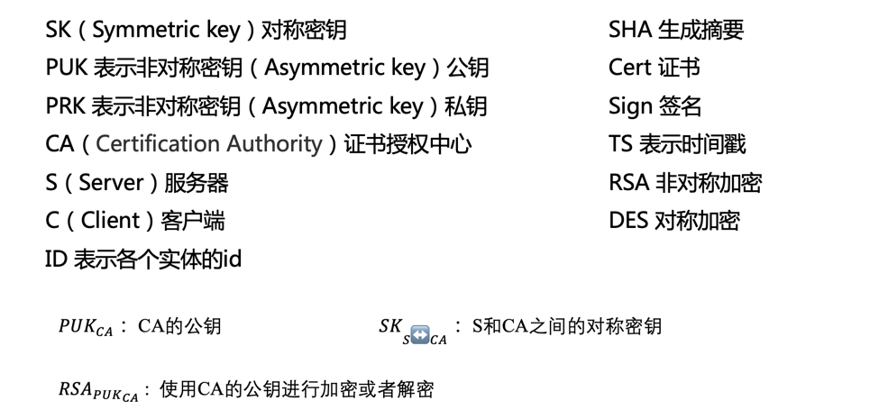
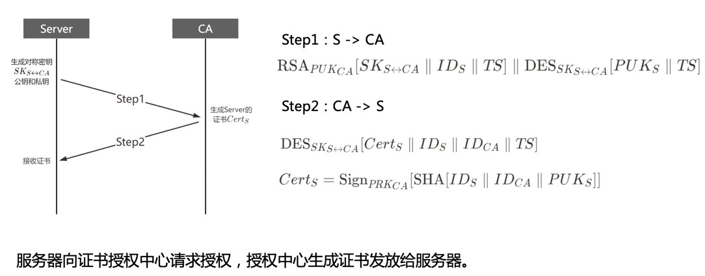
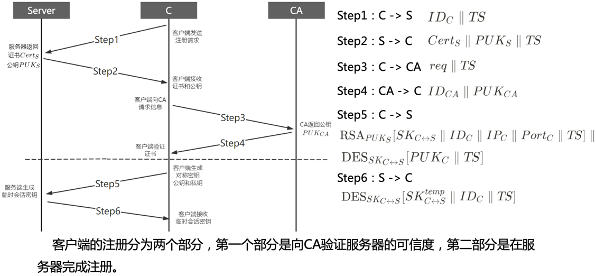
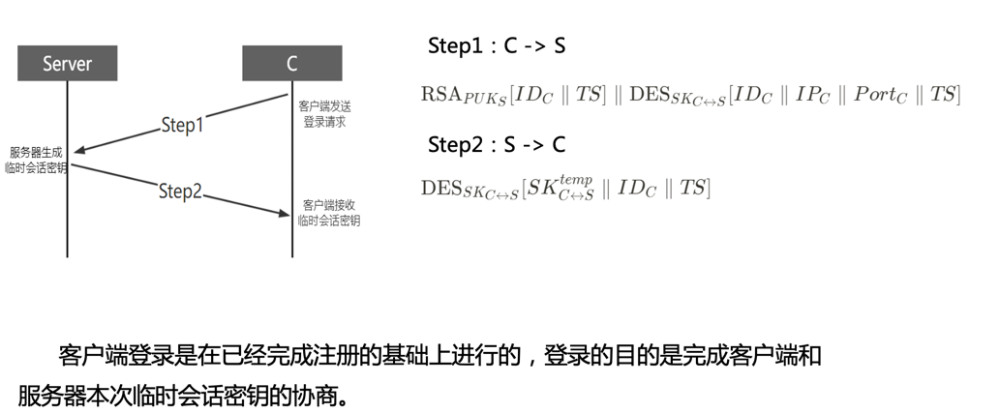
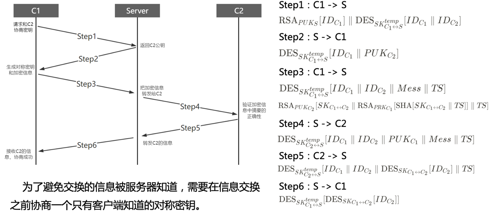
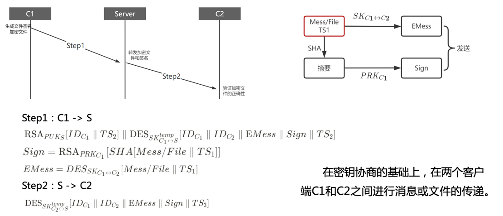

# PKI_InstantMessaging

本项目为基于PKI架构的安全及时通讯框架的演示代码，能够实现团队成员文件安全共享和接收功能，基于python实现。

框架通过非对称加密算法RSA和对称加密算法DES，对通讯过程中的信息进行加密，在防止客户端和服务器端通信受攻击者攻击的同时，保证传输的消息（文件）对服务器不可见。

框架由CA、服务器、客户端三方构成，我们将同时具有收发功能的客户端简化为主动客户端和被动客户端两种客户端进行实现。

通讯过程可以分为五步：（1）服务器注册；（2）客户端注册；（3）客户端登陆；（4）密钥协商；（5）消息（文件）传递。

## 符号说明

## 服务器注册

## 客户端注册

## 客户端登陆

## 密钥协商

## 消息（文件）传递

## 演示视频
[https://www.bilibili.com/video/BV1rW4y167zy/?vd_source=868270b9a71ad4cf3f9d9389b022032c](https://www.bilibili.com/video/BV1rW4y167zy/?vd_source=868270b9a71ad4cf3f9d9389b022032c)